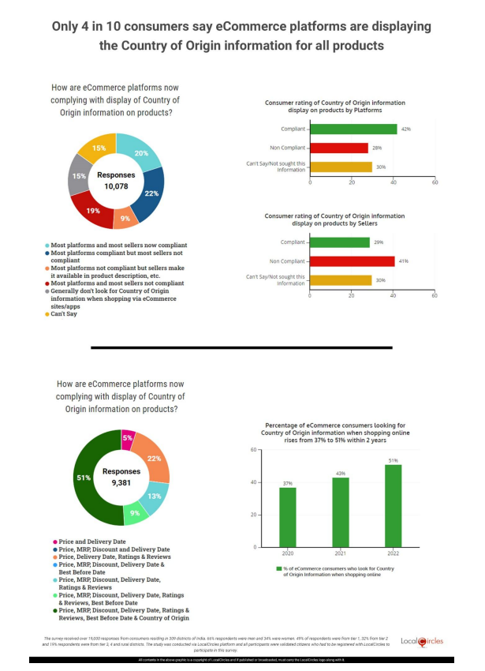

# Operation Aural Integrity

## Project Overview

Operation Aural Integrity is a groundbreaking solution designed to address the challenges faced by the luxury goods industry, focusing on countering counterfeits, ensuring authenticity, and securing warranties. Leveraging the power of the Tezos blockchain and Non-Fungible Tokens (NFTs), this project introduces a comprehensive assurance ecosystem that redefines transparency and trust in the luxury goods market.

Video link of the prototype: https://rb.gy/akn17g

## Key Features

- _Tezos Blockchain Integration:_

  - Decentralized, secure, and self-amending ledger.
  - Unique digital identifiers for transparent traceability.

- _Non-Fungible Tokens (NFTs) for Warranties:_

  - Verifiable certificates for warranty information.
  - Enhanced security and uniqueness through NFT-based warranties.

- _Smart Contracts for Authentication:_

  - Multi-faceted solutions for authenticity and warranty concerns.
  - Mobile/web applications for consumer verification.

- _Immutable Traceability:_

  - Transparent and tamper-proof supply chain on Tezos.
  - NFTs for unique, unforgeable tokens enhancing traceability.

- _Supplier Onboarding and Compliance:_

  - Rigorous compliance checks for suppliers.
  - Assurance of authenticity through Tezos blockchain.

- _Consumer Feedback with NFT-Enhanced Warranties:_

  - Mobile/web applications for enriched consumer feedback.
  - Secure feedback loop using NFT-backed warranties.

- _Continuous Monitoring and Updates:_

  - Self-amending capability of Tezos blockchain for continuous improvement.
  - Regular updates to smart contracts for evolving security measures.

- _Regulatory Compliance:_

  - Embedded features in smart contracts for regulatory adherence.
  - Alignment with industry standards and legal requirements.

- _Collaboration with Law Enforcement:_
  - Access to blockchain data and NFT-based warranty certificates for law enforcement.
  - Aid in effective counterfeit investigations.

## Survey & Market Analysis

<p align="center">
  
</p>

<p align="center">
  
</p>

<p align="center">
  
</p>

<p align="center">
  
</p>

<p align="center">
  
</p>

### Prerequisites

Before getting started with LogQuest, ensure that your development environment meets the following prerequisites:

- npm

  ```sh
  npm install npm@latest -g
  ```

- Download and install Node.js from nodejs.org.
- Verify the installation by running the following commands in your terminal:

  ```sh
  npm --version
  node --version
  ```
